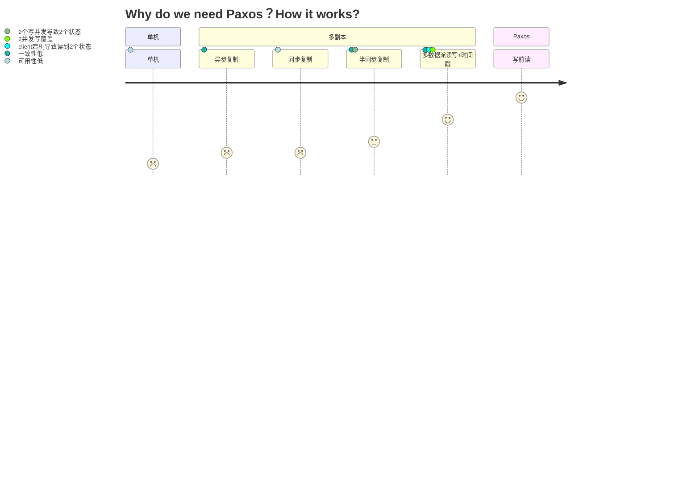

> 参考[《可靠分布式系统-paxos的直观解释》](https://blog.openacid.com/algo/paxos/)


%%{init: {'theme':'default'}}%%
	title Why do we need Paxos？How it works?
	section 单机
		单机: 1 : 可用性低
	section 多副本
		异步复制:  2: 一致性低
		同步复制:  2: 可用性低
		半同步复制:  3: 一致性低, 2个写并发导致2个状态
		多数据派读写+时间戳: 5: 一致性低, client宕机导致读到2个状态, 2并发写覆盖
	section Paxos
		写前读: 7


<!--

-->

